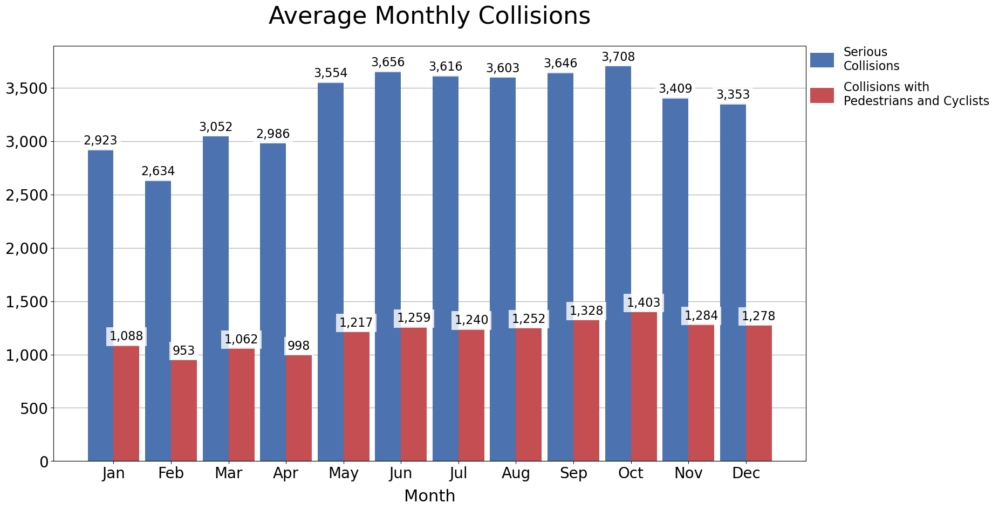

# Collisions by Month
Serious collisions are collisions that result in injury or death.

### Collisions are elevated from May to October
- Collisions with pedestrians and cyclists appear to rise from Spring and peak in October


