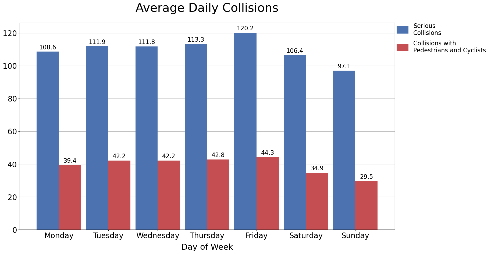
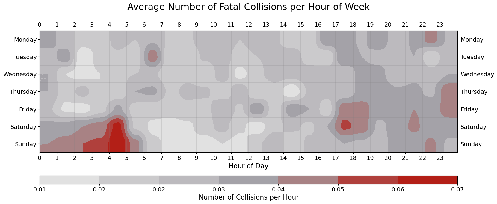

# Weekly Patterns
_Serious collisions are collisions that result in injury or death_

#### Collisions increase from Sunday to Friday
___100+ people are injured on most days___

#### Fatal collisions are most common Saturday and Sunday from 3am to 5am

#### Serious collisions are most common during evening 'rush-hours'

#### Collisions with pedestrians and cyclists have a similar pattern to serious collisions


