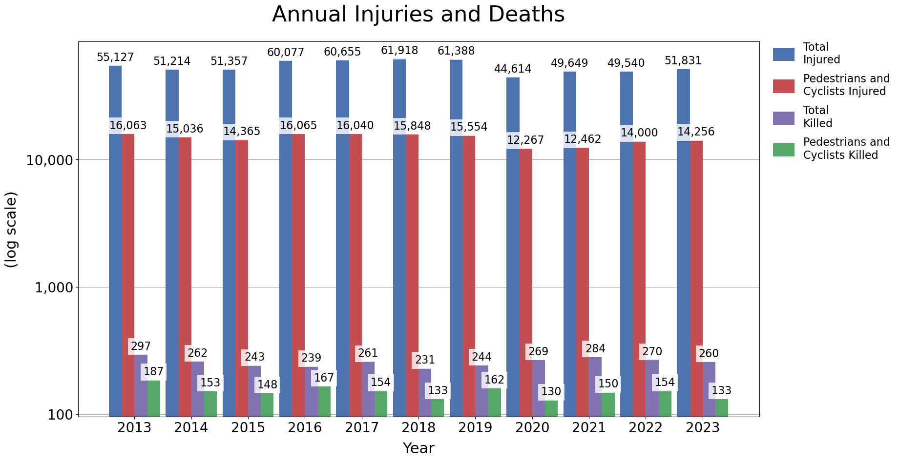

# Collisions by Year
Serious collisions are collisions that result in injury or death. 

### The number of vehicle collisions dropped sharply from 2020 onwards

### But deaths and injuries did not show a corresponding decrease
__The 'average' collision was more dangerous from 2020 onwards__
- 2020 and 2021 fatal collisions hit levels not seen since 2013
- While collisions were down ~45% in 2020 and 2021 from 2019 levels, 2020 and 2021 injuries only dropped ~27% and ~20% respectively


