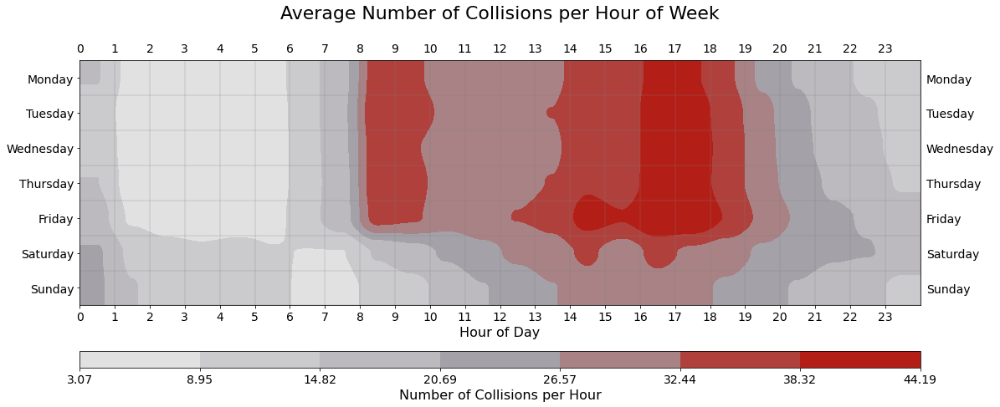
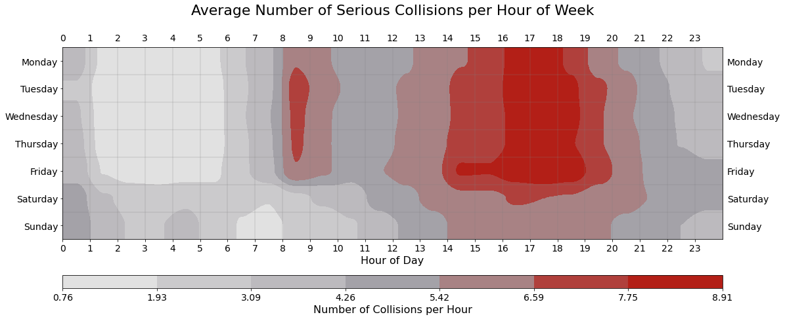
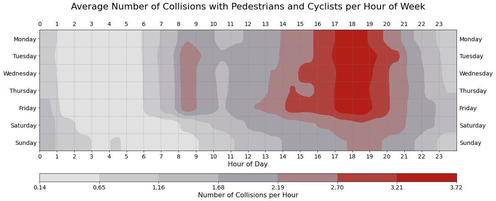
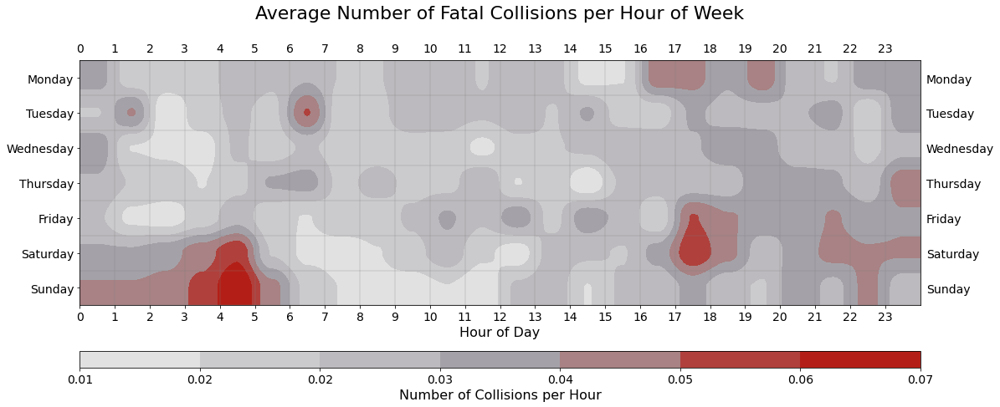
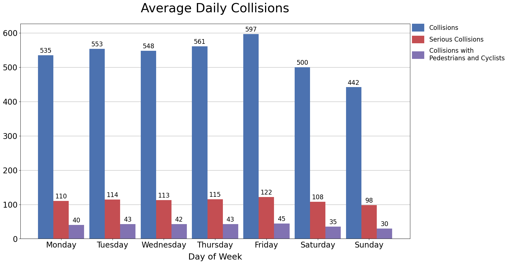

# Weekly Patterns
Serious collisions are collisions that result in injury or death.

### Collisions are most common during weekday 'rush-hours'

### Serious collisions are also most common during weekday 'rush-hours'
__However serious collisions appear more prevalent in the afternoon and evening than in the morning__

### Collisions with pedestrians and cyclists are concentrated in the afternoon and evening

### Fatal collisions have a significantly different pattern
- Fatal collisions are most common Saturday and Sunday from 3am to 5am
- Fatal collisions are elevated Friday and Saturday in the late afternoon / evening

### Collisions increase from Sunday to Friday


